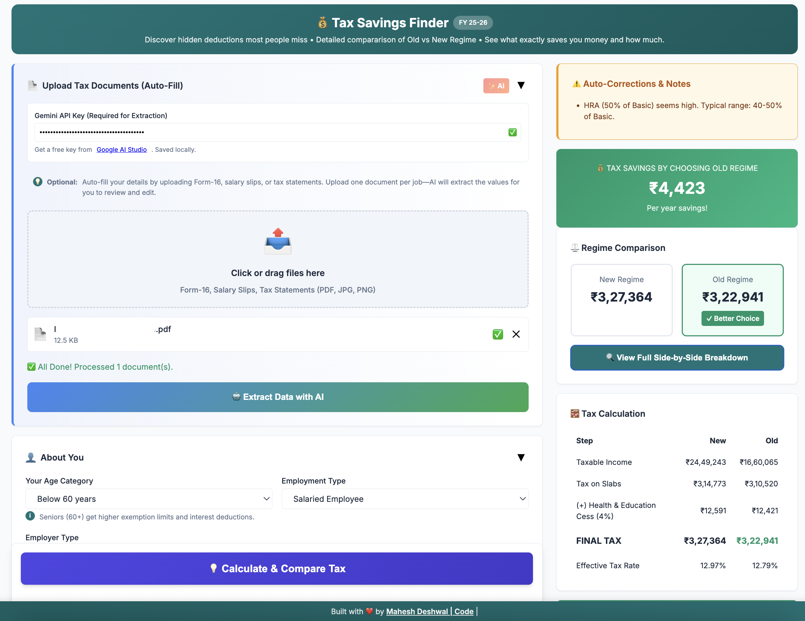
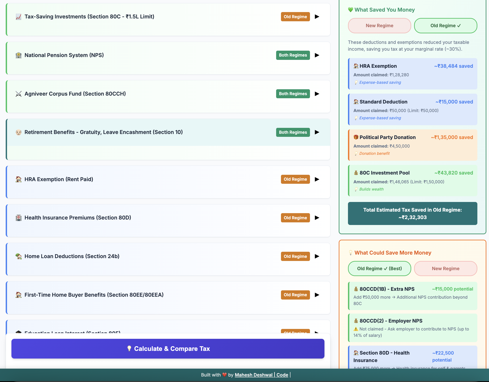

# 🇮🇳 India Tax Calculator (FY 2025-26)

**Smart, Private, and Instant Tax Planning.**

[**🔴 LIVE DEMO**](https://deshwalmahesh.github.io/intuitive-income-tax-calculator/)

## 🧐 What is this?

A privacy-focused web application that helps Indian taxpayers calculate and optimize their income tax. It compares the **Old Regime vs. New Regime** side-by-side to find your best savings. It has almost **ALL** the features which can save some tax or decrease the tax liability. It gives you a breakdown of what saved to tax, how and what else can you use to save more tax.

  
  

## 🚀 What does it do?

- **Instant Calculation**: Enter your salary details manually.
- **AI-Powered Automation**: Upload your Form-16 or payslips; the AI extracts data and fills the form for you.
- **Smart Logic**: Automatically applies complex rules for HRA, 80C, 80D, capital gains, and more.
- **Privacy First**: Everything runs in your browser. No data is sent to any server (except the AI parsing request to Google, which is stateless).

## 💡 Why does it exist?

Tax planning is confusing. Existing tools are often either too simple (ignoring complex deductions like HRA exemptions) or require sign-ups and data storage. This app solves the "What if?" scenario—letting you tweak numbers and instantly see the impact on your tax liability without storing your financial data anywhere.

## 🤖 How AI Parsing Works (Optional)

We use **Google Gemini 3 Flash**, a powerful multimodal AI model.

1.  **Read**: The app reads your uploaded PDF/Image in the browser.
2.  **Extract**: It sends a _stateless_ request to the Gemini API, asking it to identify specific tax fields (Basic Salary, HRA, 80C, etc.).
3.  **Fill**: The AI returns a structured JSON object, which the app automatically maps to the input fields.
    _Note: This feature requires a **FREE** API key from Google AI Studio. You must bring your own key to use the AI features._

## 🛠️ How to Run Locally

The simplest way—no installation required!

1.  **Clone** this repository (or download the files).
2.  **Open** the `docs/index.html` file in **Chrome** (or any modern browser).
3.  **Start** calculating!

## 🌐 Deploying to GitHub Pages

This project is structured for easy deployment on GitHub Pages.

1.  **Push** this repository to GitHub.
2.  Go to your repository's **Settings** → **Pages**.
3.  Under "Build and deployment" → "Source", select **Deploy from a branch**.
4.  Choose `main` (or your default branch) and the `/docs` folder.
5.  Click **Save**. Your site will be live at `https://<username>.github.io/<repository-name>/`.
